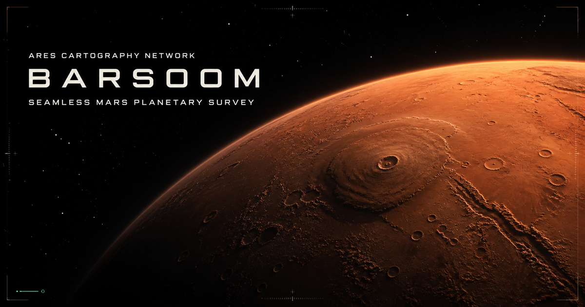
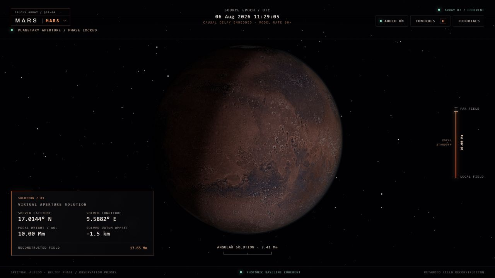
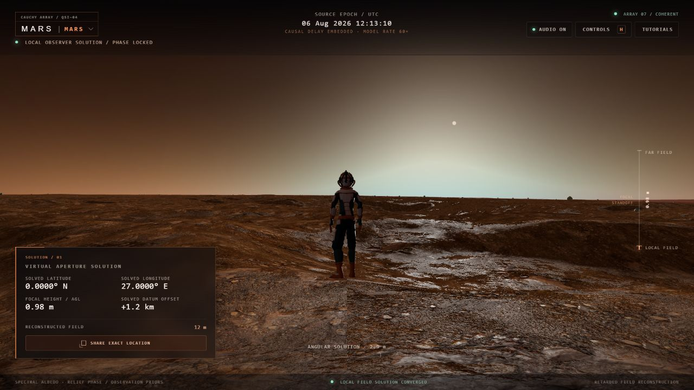

# Barsoom



| Planetary survey | Spaceman traverse at sunset |
|:---:|:---:|
|  |  |

Barsoom is a fully client-side Three.js Mars renderer that keeps one continuous camera and one geographic reference frame from a 30,000 km orbit to 0 m above local terrain. Its interface presents that continuity as the Cauchy Array: a causally limited, entanglement-enhanced interferometer that reconstructs the outgoing Martian light field at a chosen virtual focal volume. The planet is a camera-relative cube-sphere quadtree driven by NASA MOLA planetary-radius data, with deterministic procedural detail, ray-marched single-scattering atmosphere, a real bright-star catalogue, and Mars-centred ephemerides.

## Run

Requires Node.js 22.13 or newer.

```bash
npm ci
npm run dev -- --port 5190
```

Then open `http://localhost:5190`. Build and test with:

```bash
npm test
npm run build
npm run benchmark:terrain
node --test tests/rendered-html.test.mjs
```

The runtime has no terrain API, database, or application backend. Hosting only serves the compiled browser application and ordinary static assets.

## What is included

- Metre-authoritative Mars maths and latitude/longitude, Cartesian, ENU, cube-face, tile, high/low, and camera-relative conversions.
- Six-face quadtree terrain with screen-space-error selection, frustum and horizon culling, skirts, parent fallback, dithered parent/child morphing, pooled mesh containers, bounded LRU caches, and stale-job cancellation.
- 2,046 static cube-sphere tiles derived from the official 16-pixel/degree MOLA planetary-radius and areoid MEGDRs. These give complete global coverage and stream real elevation into the terrain vertices by tile.
- Worker-generated fixed-resolution terrain geometry with continuous planet-space procedural ridges, erosion, regolith detail, and three size-sorted fields of dust-mantled clasts and boulders.
- A data-driven procedural Mars PBR shader with dust, regolith, basalt, light rock, and polar frost blends.
- Bounded single-scattering integration with Rayleigh and spatially varying dust/Mie density profiles, view/sun optical depth, transmittance, planetary shadow, a thin limb, horizon haze, and terrain aerial perspective.
- Moving planet-anchored water-ice and high-altitude carbon-dioxide-ice cloud layers, cloud-shadow attenuation, regional dust veils, and camera-local surface gusts.
- 6,682 processed HYG/Hipparcos bright stars with apparent magnitude and colour index, plus Astronomy Engine heliocentric planet vectors transformed into the IAU Mars body frame.
- Clickable moving highlights for Phobos, Deimos, Mars Odyssey, MRO, and TGO, with Mars occlusion, dropdown fallback, target-lock cameras, and current orbital telemetry.
- Continuous 60×, 6×, and 1× model-rate selection, plus a wider Deimos lock framing that preserves Mars in the composition.
- Optimized official spacecraft models lazy-loaded one at a time only during close inspection, while the globe view uses low-cost orbit tracks and DOM highlights.
- Dedicated middle-orbit, right-pan, left-select, cursor-wheel zoom controls and a live orbital HUD.

See [architecture](docs/ARCHITECTURE.md), [controls](docs/CONTROLS.md), [data pipelines](docs/DATA_PIPELINES.md), [attribution](docs/ATTRIBUTION.md), [performance notes](docs/PERFORMANCE.md), and the [acceptance verification matrix](docs/VERIFICATION.md).

## Developer controls

Press `F4` for tile boundaries. The development API at `window.__BARSOOM__` exposes renderer telemetry, visual debug flags, and deterministic location/altitude setters for integration and screenshot automation.
